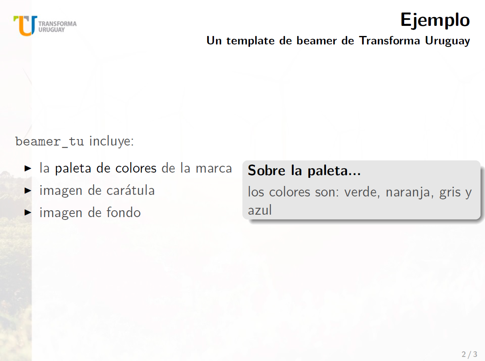

# Template de beamer de [@transformauy](https://github.com/transformauy)

Este es un `LaTeX beamer theme` para Transforma Uruguay. Está diseñado para matchear con el template oficial en Microsoft PowerPoint.

Hay un ejemplo del template [aquí.](https://github.com/paulapereda/beamer_tu/blob/master/ejemplo.pdf)

## Instalación

Copiar el archivo `beamerthemebeamer_tu.sty` en el mismo directorio en el que se encuentra tu proyecto. 
